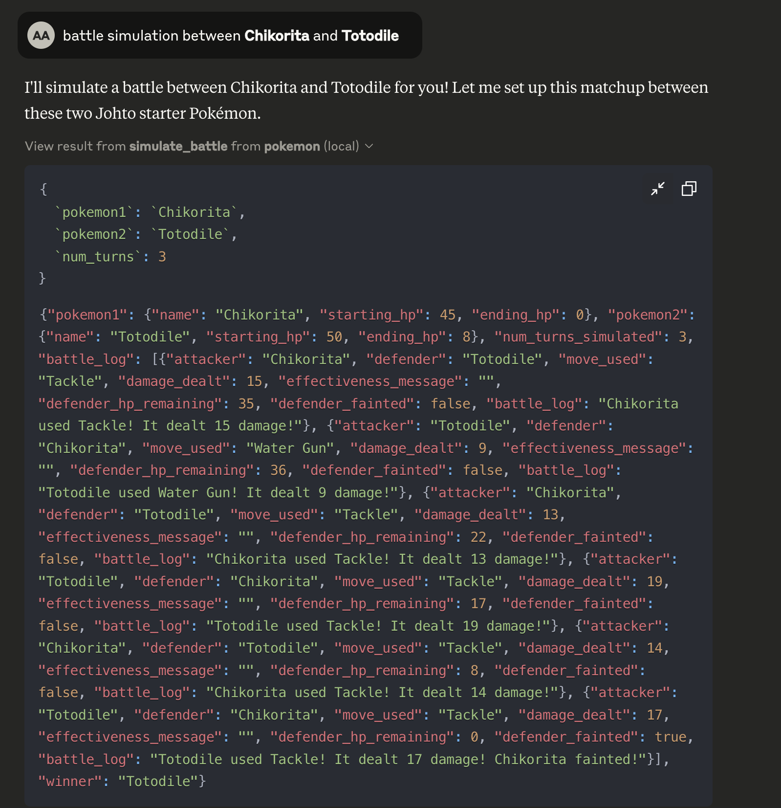
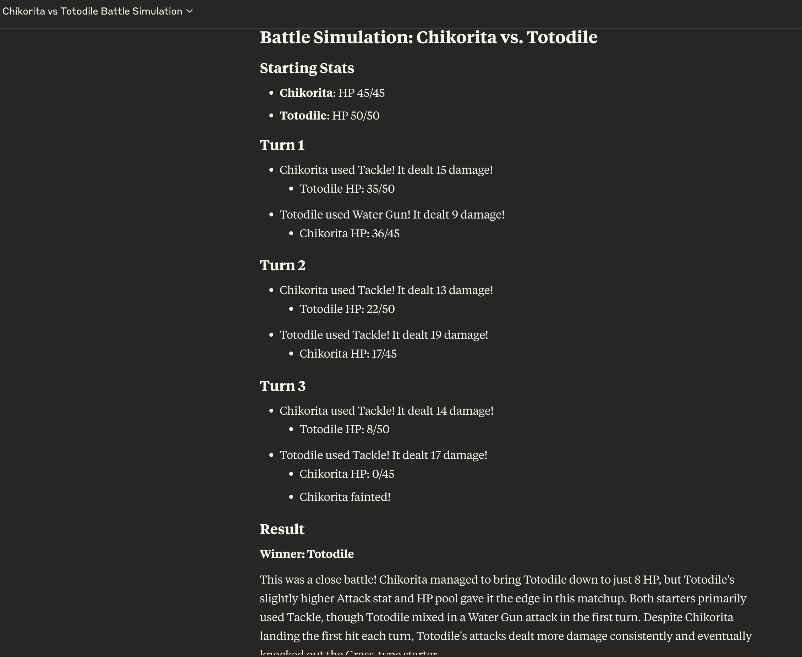

# Pokémon MCP Integration for Claude

This project implements a Model Context Protocol (MCP) integration for Pokémon data and battle simulations. It allows Claude and other LLMs to access Pokémon data and simulate battles between Pokémon through a consistent interface.

## Features

- **Pokémon Data Query System**: Access information about Pokémon, including stats, types, and abilities
- **Pokémon Battle Simulation**: Simulate battles between Pokémon with realistic game mechanics
- **MCP Integration**: Expose both systems as MCP tools for Claude and other LLMs
- **Unified Interface**: Natural language processing to intelligently route queries to the appropriate subsystem

## System Architecture

The system consists of several components:

1. **Pokémon Data System** (`pokemon_mcp/data_system/`)
   - `pokemon_query_system.py`: Core data processing system
   - `pokemon_api.py`: REST API for the data system
   - `pokemon_mcp_server.py`: MCP server for the data system

2. **Pokémon Battle System** (`pokemon_mcp/battle_system/`)
   - `pokemon_battle_system.py`: Core battle simulation system
   - `pokemon_battle_api.py`: REST API for the battle system
   - `pokemon_battle_mcp_server.py`: MCP server for the battle system

3. **Integration Layer** (`pokemon_mcp/integration/`)
   - `pokemon_mcp_integration.py`: Unified MCP server that combines both systems

4. **Runner and Client Scripts**
   - `run_pokemon_mcps.py`: Script to start the MCP servers
   - `claude_pokemon_client.py`: Client script to interact with Claude and the MCP servers

## Installation

1. Clone this repository
2. Install the required dependencies:

```bash
pip install -r requirements.txt
```

3. Create a `.env` file with your Anthropic API key (for the client script):

```
ANTHROPIC_API_KEY=your_api_key_here
```

## Usage

### Starting the MCP Servers

You can start the MCP servers using the runner script:

```bash
# Start the integrated MCP server (recommended)
python run_pokemon_mcps.py

# Or start individual servers
python run_pokemon_mcps.py --data-only  # Start only the data server
python run_pokemon_mcps.py --battle-only  # Start only the battle server
```

> **Note:** Yes, you do need to run the MCP server in the background every time you want to use the Pokémon integration with Claude. The server needs to be running for Claude to access your Pokémon data and battle simulation functionality.
>
> **Options for more convenient usage:**
> 
> 1. **Keep a terminal window open** with the server running while you use Claude
> 2. **Run as a background process** using `nohup python run_pokemon_mcps.py &` (Unix/Mac)
> 3. **Create a startup script** that you can easily run when needed
> 4. **Set up as a system service** for automatic startup (advanced)

#### Example Terminal Output

```
(.venv) .venvaysuh@GSN1-MB-539 personal project % .venv/bin/python run_pokemon_mcps.py --integrated
MCP library found.
Starting Integrated Pokémon MCP Server...
Integrated Pokémon MCP Server started successfully.

===========================================================================
Pokémon MCP Servers are now running!
===========================================================================

To connect Claude to these servers:
1. Open Claude Desktop App
2. Go to Settings > MCP Servers
3. Click 'Add Server'
4. Enter the path to the server script:
   /Users/aysuh/projects/personal project/pokemon_mcp/integration/pokemon_mcp_integration.py
5. Click 'Add' and restart Claude

Once connected, you can ask Claude about Pokémon or simulate battles!

Example queries:
- Tell me about Pikachu
- What are all the Fire-type Pokémon?
- Simulate a battle between Charizard and Blastoise
- Who would win in a fight between Mewtwo and Rayquaza?

Press Ctrl+C to stop the servers.
```

### Connecting to Claude Desktop

1. Open Claude Desktop App
2. Go to Settings > MCP Servers
3. Click 'Add Server'
4. Enter the path to the server script (e.g., `/path/to/pokemon_mcp/integration/pokemon_mcp_integration.py`)
5. Click 'Add' and restart Claude

### Using the Client Script

You can also use the provided client script to interact with Claude and the MCP servers:

```bash
python claude_pokemon_client.py pokemon_mcp/integration/pokemon_mcp_integration.py
```

### Example Queries

Once connected, you can ask Claude about Pokémon or simulate battles:

- "Tell me about Pikachu"
- "What are all the Fire-type Pokémon?"
- "Simulate a battle between Charizard and Blastoise"
- "Who would win in a fight between Mewtwo and Rayquaza?"

## Battle System Features

The battle system implements several key Pokémon game mechanics:

- Type effectiveness chart
- Physical/Special/Status moves
- STAB (Same Type Attack Bonus)
- Random damage variation
- Turn-based battle mechanics
- Battle logging

## Example Battle Simulation

Here's an example of a battle simulation between Charizard and Blastoise:




The battle simulation shows:

- **Type Effectiveness**: Water-type moves like Blastoise's Water Gun are super effective against Fire-type Pokémon like Charizard
- **Turn-based Combat**: Each Pokémon takes turns attacking
- **Damage Calculation**: Damage is calculated based on attack power, defense, and type effectiveness
- **Battle Analysis**: A summary explaining why Blastoise won (type advantage)

## Working with the MCP Tools

The MCP integration provides several tools that Claude can use:

### Battle Simulation and Data Query Tools

Claude can use the MCP tools to:

1. **Simulate Battles**: Request battles between any two Pokémon
   ```
   simulate battle between pikachu and bulbasaur
   ```

2. **Query Pokémon Information**: Get detailed stats and information
   ```
   Tell me about Pikachu
   ```

3. **Handle Errors**: The system provides helpful error messages when Pokémon names aren't found

The images above show Claude attempting to simulate a battle between Pikachu and Bulbasaur, encountering an error with the Pokémon name matching, and then trying to get information about Pikachu to troubleshoot.

### Data Query Tools and Battle Simulation:


### Data Query Tools:
```json
// Example of get_pokemon_info tool
{
  "name": "Pikachu",
  "id": 25,
  "types": ["Electric"],
  "stats": {
    "hp": 35,
    "attack": 55,
    "defense": 40,
    "sp_attack": 50,
    "sp_defense": 50,
    "speed": 90
  },
  "generation": 1,
  "abilities": []
}
```

### Battle Simulation Tools:
```json
// Example of simulate_battle tool input

{
    "pokemon1": "Chikorita",
    "pokemon2": "Totodile",
    "num_turns": 3
}

// Example of battle result
{
    "pokemon1": {
        "name": "Chikorita",
        "starting_hp": 45,
        "ending_hp": 0
    },
    "pokemon2": {
        "name": "Totodile",
        "starting_hp": 50,
        "ending_hp": 8
    },
    "num_turns_simulated": 3,
    "battle_log": [
        {
            "attacker": "Chikorita",
            "defender": "Totodile",
            "move_used": "Tackle",
            "damage_dealt": 15,
            "effectiveness_message": "",
            "defender_hp_remaining": 35,
            "defender_fainted": false,
            "battle_log": "Chikorita used Tackle! It dealt 15 damage!"
        },
        {
            "attacker": "Totodile",
            "defender": "Chikorita",
            "move_used": "Water Gun",
            "damage_dealt": 9,
            "effectiveness_message": "",
            "defender_hp_remaining": 36,
            "defender_fainted": false,
            "battle_log": "Totodile used Water Gun! It dealt 9 damage!"
        },
        {
            "attacker": "Chikorita",
            "defender": "Totodile",
            "move_used": "Tackle",
            "damage_dealt": 13,
            "effectiveness_message": "",
            "defender_hp_remaining": 22,
            "defender_fainted": false,
            "battle_log": "Chikorita used Tackle! It dealt 13 damage!"
        },
        {
            "attacker": "Totodile",
            "defender": "Chikorita",
            "move_used": "Tackle",
            "damage_dealt": 19,
            "effectiveness_message": "",
            "defender_hp_remaining": 17,
            "defender_fainted": false,
            "battle_log": "Totodile used Tackle! It dealt 19 damage!"
        },
        {
            "attacker": "Chikorita",
            "defender": "Totodile",
            "move_used": "Tackle",
            "damage_dealt": 14,
            "effectiveness_message": "",
            "defender_hp_remaining": 8,
            "defender_fainted": false,
            "battle_log": "Chikorita used Tackle! It dealt 14 damage!"
        },
        {
            "attacker": "Totodile",
            "defender": "Chikorita",
            "move_used": "Tackle",
            "damage_dealt": 17,
            "effectiveness_message": "",
            "defender_hp_remaining": 0,
            "defender_fainted": true,
            "battle_log": "Totodile used Tackle! It dealt 17 damage! Chikorita fainted!"
        }
    ],
    "winner": "Totodile"
}
```

## Data Sources

The Pokémon data is stored in CSV files in the `PokemonData` directory, with each file containing Pokémon from a specific generation (gen01.csv through gen09.csv).

## Requirements

- Python 3.8+
- MCP library
- Anthropic API key (for the client script)
- Flask (for the REST APIs)
- Pandas (for data processing)

## License

This project is for educational purposes only. Pokémon and all related properties are trademarks of Nintendo, Game Freak, and The Pokémon Company.
